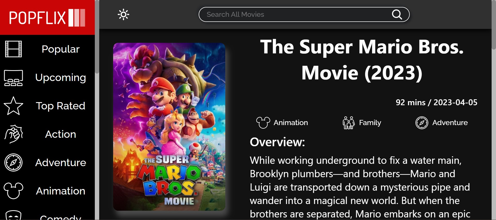
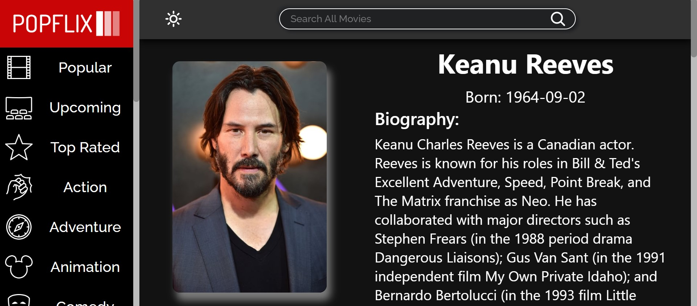

# Popflix Movie App
React app that allows users to find information about movies. Check it out [HERE](https://movie-info-app-mrlucasalmeida.vercel.app/).

## Movie Backdrop

 

## Movie List

 

## Movie Information Page

 

## Actor Information Page

 

# What I Learned
* Use caching to speed up fetch times.
* Integrated React Routers to facilitate page switches.
* Organize files in a large project.
